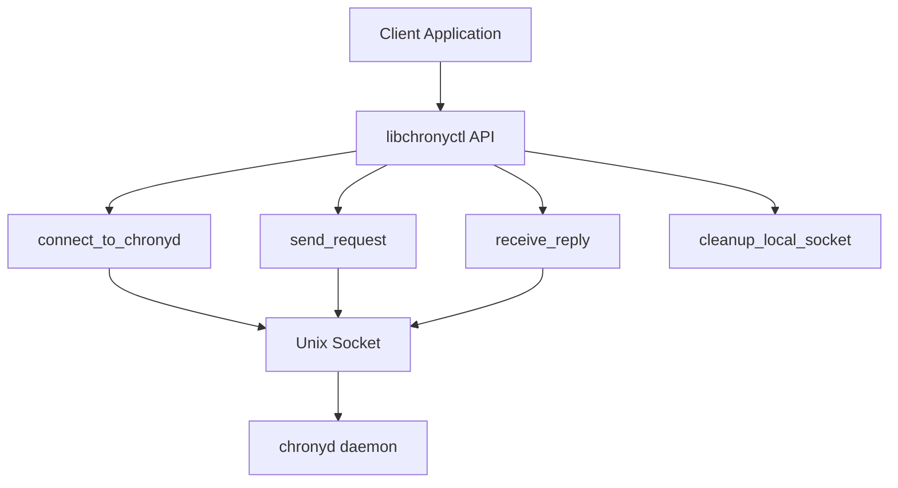
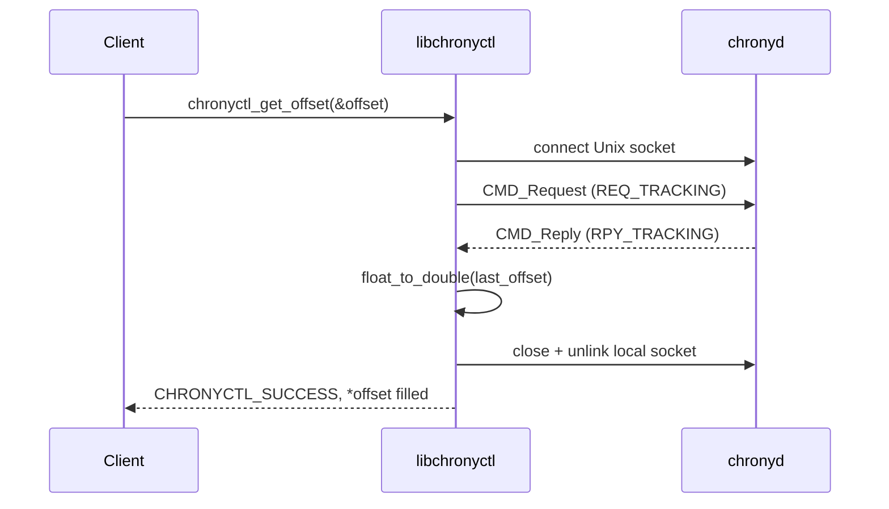
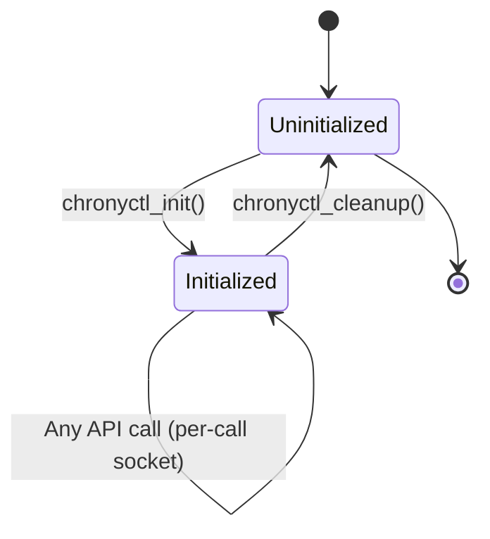
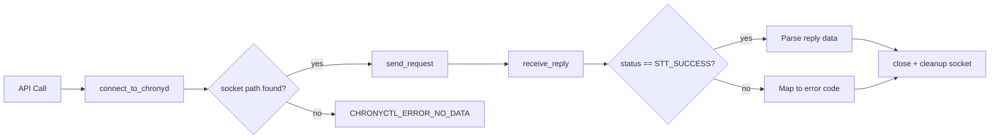
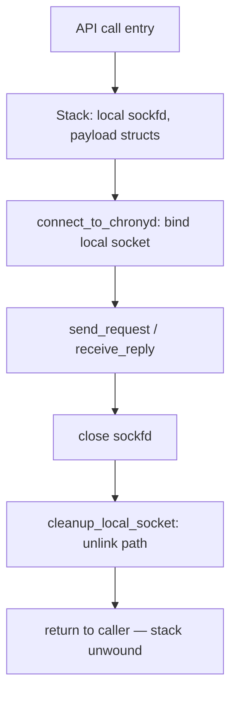

# Technical Documentation Writer for Embedded Systems

## Purpose

Create clear, comprehensive, and maintainable technical documentation for embedded C/C++ projects, with focus on architecture, APIs, concurrency safety, memory management, and platform integration. Applies specifically to the `rdklibchronyctl` library in the `time-utils` repository.

## Usage

Invoke this skill when:
- Documenting new API functions or internal mechanisms in `libchronyctl`
- Creating system architecture documentation for the chronyd control flow
- Writing API reference documentation for `chronyctl_*` functions
- Documenting socket lifecycle, protocol serialization, or error handling models
- Creating developer onboarding guides for NTP management on RDK devices
- Documenting debugging procedures for chronyd communication failures
- Writing integration guides for adding new NTP client backends

## Documentation Structure

### Directory Layout

```
time-utils/
├── README.md                          # Project overview, quick start
├── CHANGELOG.md                       # Version history
├── CONTRIBUTING.md                    # Contribution guidelines
├── docs/                              # General documentation
│   ├── README.md                      # Documentation index
│   ├── architecture/                  # System architecture
│   │   ├── overview.md               # High-level architecture
│   │   ├── component-diagram.md      # Component relationships
│   │   ├── socket-protocol.md        # chronyd Unix socket protocol
│   │   └── data-flow.md              # Request/reply data flow
│   ├── api/                          # API documentation
│   │   ├── public-api.md            # chronyctl_* public API reference
│   │   └── error-codes.md           # chronyctl_error enum reference
│   ├── integration/                  # Integration guides
│   │   ├── build-setup.md           # Autotools build setup
│   │   ├── backend-porting.md       # Adding new NTP client backends
│   │   └── testing.md               # Test procedures with test_timectl
│   └── troubleshooting/             # Debug guides
│       ├── socket-errors.md         # chronyd socket connection failures
│       ├── source-not-found.md      # NOSUCHSOURCE / DNS rotation issues
│       └── common-errors.md         # Error code reference and recovery
└── libchronyctl/                     # Library source
    ├── libchronyctl.c               # Implementation
    ├── libchronyctl.h               # Public API header
    ├── addressing.h                 # IPAddr types (host byte-order)
    ├── candm.h                      # chronyd protocol data model
    ├── Makefile.am                  # Autotools build recipe
    └── test_timectl.c               # Backend-agnostic CLI test binary
```

### Document Types

#### 1. **Architecture Documentation** (`docs/architecture/`)
- System overview and design principles
- chronyd Unix socket protocol and framing
- Request/reply data flow (CMD_Request / CMD_Reply)
- Socket lifecycle per API call
- Memory management strategies (stack-heavy, no persistent heap)
- Backend-agnostic abstraction via `ntp_ops_t`

#### 2. **API Documentation** (`docs/api/`)
- Public `chronyctl_*` API reference with examples
- `chronyctl_error` enum: codes, meaning, recovery
- Function contracts and preconditions (e.g., `chronyctl_init()` requirement)
- Thread-safety guarantees (callers must serialize; no internal mutex)
- Memory ownership semantics (all stack/static; no heap returned to caller)
- Error handling conventions and `chronyctl_strerror()`

#### 3. **Library Documentation** (`libchronyctl/`)
- Per-module technical details (`libchronyctl.c`, `addressing.h`, `candm.h`)
- Protocol serialization algorithm (byte-order conversion, request length table)
- DNS-rotation-safe source lookup (`find_source_ip_by_name()`)
- Implementation notes for `Float` ↔ `double` conversion
- Resource usage (stack ~4KB per call, no persistent state beyond init flag)
- Internal helper function contracts

#### 4. **Integration Guides** (`docs/integration/`)
- Autotools build setup (`configure.ac`, `Makefile.am`)
- Adding a new NTP backend to `test_timectl` (`ntp_ops_t` table)
- Configuration options (socket paths, poll intervals)
- Test procedures with `test_timectl` CLI
- Deployment checklists for RDK devices

#### 5. **Troubleshooting Guides** (`docs/troubleshooting/`)
- chronyd socket unreachable (`CHRONYCTL_ERROR_NO_DATA`)
- NOSUCHSOURCE failures and DNS-rotation root cause
- `CHRONYCTL_ERROR_UNAUTH` on restricted chronyd sockets
- Stale local socket cleanup (`/var/run/chronyc.<pid>.sock`)
- Common error code recovery strategies

## Documentation Process

### Step 1: Analyze the Code

Before writing documentation:

1. **Read the source code** - Understand the implementation in `libchronyctl.c`
2. **Identify key abstractions** - `chronyctl_error`, `IPAddr`, `CMD_Request`, `CMD_Reply`, `ntp_ops_t`
3. **Map dependencies** - `libchronyctl.c` → `candm.h` → `addressing.h`; `test_timectl.c` → `libchronyctl.h`
4. **Trace socket lifecycle** - `connect_to_chronyd()` → `send_request()` → `receive_reply()` → `close()` + `cleanup_local_socket()`
5. **Trace resource lifecycle** - All resources are per-call; no persistent heap; local socket unlinked on exit
6. **Review existing docs** - `README.md` contains architecture overview and API summary

### Step 2: Create Structure

For each component or function group:

```markdown
# Component Name

## Overview
Brief 2-3 sentence description of purpose and role.

## Architecture
High-level design with diagrams.

## Key Components
List main structures, functions, modules.

## Socket Lifecycle
How each API call manages its Unix socket connection.

## Memory Management
Stack vs. heap allocation patterns, ownership rules.

## API Reference
Public functions with signatures and examples.

## Usage Examples
Common use cases with code snippets.

## Error Handling
Error codes, failure modes, recovery.

## Performance Considerations
Resource usage, latency, bottlenecks.

## Platform Notes
Platform-specific behavior (socket paths, chronyd version requirements).

## Testing
How to test with test_timectl, expected outputs.

## See Also
Cross-references to related documentation.
```

### Step 3: Add Diagrams

Use Mermaid for visual documentation:

#### Component Diagram


#### Sequence Diagram


#### State Diagram


#### Data Flow Diagram


### Step 4: Add Code Examples

Provide clear, compilable examples:

#### Good Example Structure
```markdown
### Example: Querying Current NTP Offset

This example shows how to initialize the library and query the current
clock offset reported by chronyd.

**Prerequisites:**
- chronyd running and accessible at `/var/run/chrony/chronyd.sock`
- Library linked (`-lchronyctl -lm`)

**Code:**
```c
#include "libchronyctl.h"
#include <stdio.h>

int main(void) {
    double offset = 0.0;
    int ret;

    ret = chronyctl_init();
    if (ret != CHRONYCTL_SUCCESS) {
        fprintf(stderr, "Init failed: %s\n", chronyctl_strerror(ret));
        return 1;
    }

    ret = chronyctl_get_offset(&offset);
    if (ret != CHRONYCTL_SUCCESS) {
        fprintf(stderr, "get_offset failed: %s\n", chronyctl_strerror(ret));
        chronyctl_cleanup();
        return 1;
    }

    printf("Current NTP offset: %.6f seconds\n", offset);

    chronyctl_cleanup();
    return 0;
}
```

**Expected Output:**
```
Current NTP offset: 0.000123 seconds
```

**Notes:**
- Always check return values against `CHRONYCTL_SUCCESS`
- Call `chronyctl_cleanup()` on all exit paths
- `CHRONYCTL_ERROR_NO_DATA` means chronyd socket is unreachable
```
\`\`\`

### Step 5: Document APIs

For each public function use this template:

```markdown
### chronyctl_get_offset()

Queries chronyd for the current NTP clock offset.

**Signature:**
```c
int chronyctl_get_offset(double *offset_sec);
```

**Parameters:**
- `offset_sec` - Output pointer to receive the offset in seconds (must not be NULL)

**Returns:**
- `CHRONYCTL_SUCCESS` (0) - Success; `*offset_sec` filled with last offset
- `CHRONYCTL_ERROR_NOT_INIT` (-2) - `chronyctl_init()` was not called
- `CHRONYCTL_ERROR_NO_DATA` (-7) - Cannot connect to chronyd socket
- `CHRONYCTL_ERROR_EXEC` (-3) - Protocol exchange failed
- `CHRONYCTL_ERROR_INVALID` (-5) - `offset_sec` is NULL

**Thread Safety:**
Not internally thread-safe. If multiple threads share a library handle,
the caller must serialize all `chronyctl_*` calls with an external mutex.

**Memory:**
No heap allocation. `offset_sec` must point to caller-allocated storage.
The library uses stack-only locals; all resources freed before return.

**Example:**
See [Example: Querying Current NTP Offset](#example-querying-current-ntp-offset)

**See Also:**
- `chronyctl_makestep()` — force an immediate clock correction
- `chronyctl_has_selectable_source()` — check source availability
- `chronyctl_strerror()` — human-readable error messages
```

### Step 6: Document Concurrency

For the `libchronyctl` library:

```markdown
## Concurrency Model

### No Background Threads

`libchronyctl` spawns no threads. Every API call is synchronous:
opens a Unix socket, exchanges exactly one request/reply pair, then closes
the socket before returning.

### Internal State

```c
static int chronyctl_initialized = 0;  // Set by chronyctl_init()
static uint32_t chrony_sequence = 0;   // Incremented per request
```

Both variables are unprotected. Concurrent calls from multiple threads will
race on `chrony_sequence` and risk opening overlapping local socket paths
named `/var/run/chronyc.<pid>.sock`.

### Caller Responsibility

If `libchronyctl` is used from a multi-threaded application, the caller must
serialize all `chronyctl_*` calls:

```c
// Example: wrapping with an application-level mutex
static pthread_mutex_t ntp_mutex = PTHREAD_MUTEX_INITIALIZER;

int safe_get_offset(double *offset) {
    pthread_mutex_lock(&ntp_mutex);
    int ret = chronyctl_get_offset(offset);
    pthread_mutex_unlock(&ntp_mutex);
    return ret;
}
```

### Thread Safety Summary

| Function | Thread Safety | Notes |
|----------|---------------|-------|
| `chronyctl_init()` | Not thread-safe | Call once before any other API |
| `chronyctl_cleanup()` | Not thread-safe | Call once when done |
| `chronyctl_get_offset()` | Not thread-safe | Serialize with external mutex |
| `chronyctl_makestep()` | Not thread-safe | Serialize with external mutex |
| `chronyctl_add_server()` | Not thread-safe | Serialize with external mutex |
| `chronyctl_delete_server()` | Not thread-safe | Serialize with external mutex |
| `chronyctl_set_poll()` | Not thread-safe | Serialize with external mutex |
| `chronyctl_burst()` | Not thread-safe | Serialize with external mutex |
| `chronyctl_online()` | Not thread-safe | Serialize with external mutex |
| `chronyctl_has_selectable_source()` | Not thread-safe | Serialize with external mutex |
| `chronyctl_strerror()` | Thread-safe | Returns pointer to static string |
```

### Step 7: Document Memory Management

```markdown
## Memory Management

### Allocation Pattern

`libchronyctl` uses a stack-only model. Every API function allocates its
working data on the stack and releases all resources (socket fd + local socket
path) before returning. There are no persistent heap allocations after init.



### Ownership Rules

1. **Output parameters** (`double *offset_sec`, `int *has_selectable`):  
   Allocated by caller; filled by the library on `CHRONYCTL_SUCCESS`.
2. **String inputs** (e.g., `const char *address`):  
   Owned by caller; library copies into stack-local payload structs via `strncpy`.
3. **Local socket** (`/var/run/chronyc.<pid>.sock` or `/tmp/chronyc.<pid>.sock`):  
   Created by the library at call start; unlinked by `cleanup_local_socket()` before return.

### Lifecycle Example

```c
// Init — sets chronyctl_initialized flag; no allocation
chronyctl_init();

// Per-call — all resources on stack, socket opened and closed internally
double offset;
chronyctl_get_offset(&offset);      // socket open → exchange → socket closed

chronyctl_add_server("pool.ntp.org", 6, 10); // socket open → exchange → closed

// Cleanup — clears initialized flag; no free() needed
chronyctl_cleanup();
```

### Memory Budget

| Resource | Size | Lifetime | Notes |
|----------|------|----------|-------|
| `CMD_Request` payload | 520 bytes max | Stack, per-call | Largest for `REQ_ADD_SOURCE` |
| `CMD_Reply` buffer | 488 bytes | Stack, per-call | Fixed `sizeof(CMD_Reply)` |
| Local socket path | 108 bytes | FS, per-call | Unlinked before return |
| Socket fd | 4 bytes | Kernel, per-call | Closed before return |
| Static state | 8 bytes | Library lifetime | `initialized` + `sequence` |

**Total persistent footprint**: 8 bytes static; zero heap.
```

## Best Practices

### Writing Style

1. **Be Concise**: Get to the point quickly
2. **Be Specific**: Use exact terms (`CHRONYCTL_ERROR_NO_DATA`, not "socket error")
3. **Be Accurate**: Test all code examples against a live chronyd instance
4. **Be Complete**: Document every error code a caller might receive
5. **Be Consistent**: Follow the naming pattern `chronyctl_*` throughout

### Code Examples

- **Always compile-test** examples against the actual `libchronyctl.h` API
- **Show error handling** — embedded production code must handle every error path
- **Include cleanup** — always call `chronyctl_cleanup()` on all exit paths
- **Add context** — explain why `chronyctl_init()` must precede any API call
- **Keep focused** — one example demonstrates one specific operation

### Diagrams

- **Use Mermaid** for all diagrams (version control friendly, renders in GitHub)
- **Keep simple** — max 10-12 nodes per diagram
- **Label clearly** — all arrows show the data type or function name
- **Show the socket lifecycle** — open → send → recv → close is the key pattern
- **Add legends** — explain `STT_SUCCESS`, `RPY_NULL`, etc. if shown in diagrams

### Cross-References

Link related documentation:

```markdown
## See Also

- [Socket Protocol](../architecture/socket-protocol.md) - chronyd command protocol
- [Error Codes](../api/error-codes.md) - Complete chronyctl_error reference
- [Backend Porting](../integration/backend-porting.md) - Adding NTP client backends
- [Build Guide](../integration/build-setup.md) - Autotools compilation
```

### Platform-Specific Notes

Always document platform variations:

```markdown
## Platform Notes

### Linux (general)
- chronyd socket path: `/var/run/chrony/chronyd.sock` (primary) or `/run/chrony/chronyd.sock`
- Local socket path: `/var/run/chronyc.<pid>.sock` (fallback: `/tmp/chronyc.<pid>.sock`)
- `chmod 0666` applied to local socket for unprivileged access

### RDK Broadband / RDKV Devices
- chronyd managed by systemd or init scripts; socket path is standard
- Library integrates without rbus or RDK logger — pure C POSIX API
- Memory constraints: library footprint is ~8 bytes static; suitable for any RDK target

### Constraints
- **chronyd version**: Tested with chrony 3.x+ protocol (`PROTO_VERSION_NUMBER`)
- **IPv4 only**: `addressing.h` / `parse_address()` resolves IPv4 only in current implementation
- **Memory**: Library uses <1KB stack per call; no minimum RAM requirement beyond kernel limits
- **CPU**: No background polling; zero CPU when idle
```

## Output Format

### Component Documentation Template

```markdown
# [Component Name]

## Overview

[2-3 sentence description]

## Architecture

[High-level design explanation]

### Component Diagram
```mermaid
[Component relationship diagram]
```

## Key Components

### [Structure/Type Name]

[Description]

```c
typedef struct {
    // Fields with comments
} structure_t;
```

## Socket Lifecycle

[How each API call manages its Unix socket connection]

## Memory Management

[Stack vs. heap allocation patterns, ownership rules]

## API Reference

### [chronyctl_*()]

[Full API documentation]

## Usage Examples

### Example: [Use Case]

[Complete working example]

## Error Handling

[Error codes, failure modes, recovery]

## Performance

[Resource usage and latency]

## Platform Notes

[chronyd socket paths, version requirements]

## Testing

[Test procedures with test_timectl, expected outputs]

## See Also

[Cross-references]
```

## Quality Checklist

Before considering documentation complete:

- [ ] All `chronyctl_*` public APIs documented with signatures
- [ ] At least one working code example per major function group
- [ ] Thread safety (not internally thread-safe) explicitly stated
- [ ] Memory ownership clearly documented (stack-only, no heap returned)
- [ ] All `chronyctl_error` codes and meanings listed
- [ ] Diagrams for socket lifecycle and data flow
- [ ] Cross-references to related docs
- [ ] Platform-specific socket path notes included
- [ ] Code examples compile (`-lchronyctl -lm`) and produce correct output
- [ ] Grammar and spelling checked
- [ ] Reviewed by component author

## Maintenance

Documentation is code:

1. **Update with code changes** — if a new `REQ_*` command is added, update API docs and diagrams
2. **Version documentation** — tag with CHANGELOG entries
3. **Review periodically** — verify socket paths and chronyd version compatibility quarterly
4. **Fix broken links** — validate cross-references after restructuring
5. **Deprecate carefully** — if a function is removed, add deprecation notice one release prior

### Deprecation Notice Template

```markdown
## DEPRECATED: chronyctl_old_function()

⚠️ **This function is deprecated as of v2.1.0**

**Reason**: Incorrect byte-order handling in edge case

**Alternative**: Use `chronyctl_new_function()` instead

**Migration Example**:
```c
// Old way (deprecated)
chronyctl_old_function(address);

// New way
chronyctl_new_function(address, minpoll, maxpoll);
```

**Removal**: Scheduled for v3.0.0
```

## Tools Integration

### Generate API Docs from Code

Use Doxygen-style comments already present in `libchronyctl.h`:

```c
/**
 * @brief Get current time offset from chronyd
 *
 * Connects to the chronyd Unix socket, sends REQ_TRACKING, and extracts
 * the last_offset field from the RPY_Tracking reply.
 *
 * @param[out] offset_sec  Receives the offset in seconds (must not be NULL)
 *
 * @return CHRONYCTL_SUCCESS on success, error code otherwise
 * @retval CHRONYCTL_SUCCESS     Offset filled successfully
 * @retval CHRONYCTL_ERROR_NOT_INIT  chronyctl_init() not called
 * @retval CHRONYCTL_ERROR_NO_DATA   chronyd socket unreachable
 * @retval CHRONYCTL_ERROR_EXEC      Protocol exchange failed
 * @retval CHRONYCTL_ERROR_INVALID   offset_sec is NULL
 *
 * @note Not internally thread-safe; serialize with an external mutex.
 * @see chronyctl_makestep(), chronyctl_strerror()
 */
int chronyctl_get_offset(double *offset_sec);
```

### Diagram Tools

- **Mermaid Live Editor**: https://mermaid.live
- **VS Code Markdown Preview**: Built-in mermaid support
- **Documentation generators**: Can embed mermaid in output

## Troubleshooting Common Documentation Issues

### Issue: Code example doesn't compile

**Solution**: Always test examples in isolation against the real library
```bash
# Compile against libchronyctl from the build directory
gcc -Wall -Wextra -I./libchronyctl example.c \
    ./libchronyctl/.libs/libchronyctl.a -lm -o example

# Or use test_timectl as a reference
./test_timectl offset_check
```

### Issue: Diagram is too complex

**Solution**: Break into multiple diagrams
- One high-level API-to-socket overview
- One focused sequence diagram per operation type (query vs. modify)
- Link them together in text

### Issue: Outdated documentation

**Solution**: Add CI check
```bash
# Check for TODOs in docs
grep -r "TODO\|FIXME\|XXX" docs/ && exit 1

# Check for broken links
markdown-link-check docs/**/*.md
```

## Examples From This Project

See existing files for documentation and usage reference:
- [README.md](../../../README.md) - Architecture overview and API summary with Mermaid diagram
- [libchronyctl.h](../../../libchronyctl/libchronyctl.h) - Doxygen-style API documentation model
- [test_timectl.c](../../../libchronyctl/test_timectl.c) - Backend-agnostic usage patterns and CLI examples
- [Memory Safety Skill](../memory-safety-analyzer/SKILL.md) - Example skill documentation structure
- [Build Instructions](../../../.github/instructions/build-system.instructions.md) - Integration guide example
