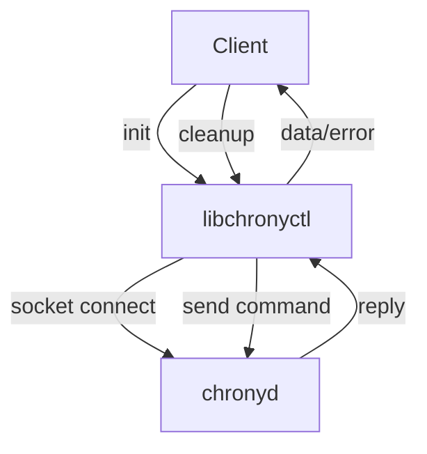

# time-utils

`rdklibchronyctl` provides a standardized C library for controlling and managing the `chronyd` NTP daemon on RDK-based devices, enabling programmatic control, configuration, source management, and time synchronization analysis.


---

## Component Purpose and Problem Statement

The **RDK Chrony Control Library (`rdklibchronyctl`)** is a lightweight C library that enables programmatic control of the NTP daemon. This library replaces the  chronyc CLI-based approach, providing better performance and reliability for RDK devices' time synchronization management.  

While primarily designed for `chronyd`, the API and architecture can be readily extended to support other NTP clients. 

### `rdklibchronyctl`'s role:

- **Control**: Send, receive, and interpret commands to `chronyd` over its native Unix socket protocol.
- **Management**: Add/delete servers, set poll intervals, trigger bursts, and force clock corrections.
- **Analysis/Diagnostics**: Query offset, status, and detailed source data for telemetry or health checks.
- **Abstraction**: Offer a backend-agnostic API; easily extensible to other NTP daemons (see code for details).

---

## Runtime Execution Flow

Typical usage pattern:

1. Library client calls `chronyctl_init()`.
2. Interacts with chronyd: add/remove server, set poll, step time, get offset, etc.
3. Handles error codes for socket/protocol/state errors (see API below).
4. Library client calls `chronyctl_cleanup()`.

See `test_timectl.c` for a rich usage example.

---

## Repository Structure

```
rdkchronylibctl/
├── libchronyctl.c    # Implementation of the high-level control APIs
├── libchronyctl.h    # Public API header
├── addressing.h      # Network address types/helpers
├── candm.h           # Chrony protocol data model/types
├── Makefile.am       # Autotools build recipe for lib and tests
├── test_timectl.c    # Backend-agnostic test binary and sample CLI
```

---

## Library Architecture & API

### Core Modules

- `libchronyctl.c`:
    - Implements connection lifecycle, protocol serialization, error handling, server state management.
    - Abstracts direct chronyd socket protocol; can be extended for other daemon types.
- `libchronyctl.h`: API definitions and error codes.
- `addressing.h`, `candm.h`: Structures for network/protocol.

### High-Level Control Flow



---

## Inputs and Outputs

### API/CLI Inputs

- **Client API**:
    - `chronyctl_init() / chronyctl_cleanup()`
    - `chronyctl_get_offset(double *offset_sec)`
    - `chronyctl_makestep()`
    - `chronyctl_add_server(const char *address, int minpoll, int maxpoll)`
    - `chronyctl_delete_server(const char *address)`
    - `chronyctl_set_poll(const char *address, int minpoll, int maxpoll)`
    - `chronyctl_burst(const IPAddr *addr, ...)`
- **CLI**:
    - `test_timectl` provides:
      - `offset_check`
      - `makestep`
      - `server [host [minpoll [maxpoll]]]`
      - `delete_server [host]`
      - `burst [n_good [n_total [addr [mask]]]]`
      - `set_poll <host> <minpoll> <maxpoll>`

### Outputs

- **Return codes** (see `chronyctl_error` enum)
- **Console/log data** for `test_timectl`
- **Direct impact**: configuration and state change of local `chronyd` instance via its socket API

---

## Error Codes

Standardized error codes (see `libchronyctl.h`):

- `CHRONYCTL_SUCCESS`
- `CHRONYCTL_ERROR_INIT`
- `CHRONYCTL_ERROR_NOT_INIT`
- `CHRONYCTL_ERROR_EXEC`
- `CHRONYCTL_ERROR_PARSE`
- `CHRONYCTL_ERROR_INVALID`
- `CHRONYCTL_ERROR_NO_DATA`
- `CHRONYCTL_ERROR_UNAUTH`

Every API call returns a code, and `chronyctl_strerror(int err)` provides a human-readable description.

---

## Build

### Prerequisites

- Standard build toolchain: `autoconf`, `automake`, `libtool`, `make`, `gcc`
- Library requires runtime access to the `chronyd` Unix socket (typically `/var/run/chrony/chronyd.sock`).

### Configure and Build

```bash
autoreconf -fi
./configure
make -j$(nproc)
```

This will build both the shared library and test programs.

---

## Usage

Library:
```c
#include "libchronyctl.h"
chronyctl_init();
double offset;
if (chronyctl_get_offset(&offset) == CHRONYCTL_SUCCESS) {
    printf("Current time offset: %.9f\n", offset);
}
chronyctl_cleanup();
```

Test binary:
```bash
./test_timectl offset_check
./test_timectl server time.xfinity.com 6 10
./test_timectl delete_server time.xfinity.com
./test_timectl set_poll pool.ntp.org 6 10
```

---

## Testing

- **Unit/functional tests:** `test_timectl.c` contains all operational scenarios. Run:
    ```bash
    ./test_timectl <command>
    ```
    See in-file usage for command options.

---

## Troubleshooting

- Ensure `chronyd` is running and the socket is accessible (permissions and path).
- Use `chronyctl_strerror(err)` to decode error codes.

---

## Documentation

- [HLA: RDK Chrony Control Library](https://etwiki.sys.comcast.net/display/RDKDocumentation/HLA%3A+RDK+Chrony+Control+Library) (Comcast internal)
- See code comments and `test_timectl.c` for API examples.

---

## Contributing

See [CONTRIBUTING.md](CONTRIBUTING.md).

---

## License

Licensed under Apache-2.0. See [LICENSE](LICENSE).
