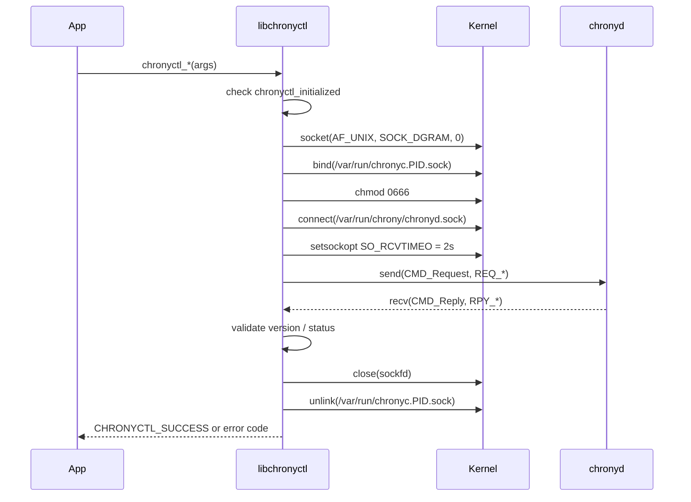
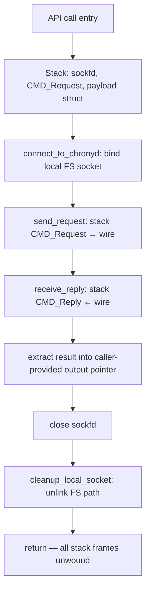

# rdklibchronyctl — Project Overview

## Overview

`libchronyctl` is a lightweight, embedded C library that provides programmatic control of the `chronyd` NTP daemon on RDK-based devices. It communicates directly over chronyd's native Unix domain socket protocol, replacing fragile `chronyc` CLI subprocess invocations with a typed, in-process API. While designed primarily for `chronyd`, the repository also ships a backend-agnostic test binary (`test_timectl`) whose `ntp_ops_t` function-pointer table can accommodate other NTP clients with no changes to the test harness.

---

## Architecture

The library is a thin synchronous shim between the calling application and the `chronyd` daemon. Every public API call follows the same three-step pattern: open a per-process Unix socket, exchange exactly one request/reply packet with chronyd, then close and unlink the socket before returning. There are no background threads, no connection pool, and no persistent heap allocations.

### Component Diagram

```mermaid
graph TB
    A[Client Application] -->|chronyctl_*| B[libchronyctl public API]
    B --> C[connect_to_chronyd]
    C -->|AF_UNIX SOCK_DGRAM| D[/var/run/chrony/chronyd.sock]
    D -->|Unix socket| E[chronyd daemon]
    B --> F[send_request\nCMD_Request + hton serialization]
    F --> D
    B --> G[receive_reply\nCMD_Reply + ntoh deserialization]
    G --> D
    B --> H[cleanup_local_socket\nunlink /var/run/chronyc.PID.sock]
    I[test_timectl CLI] -->|ntp_ops_t vtable| B
```

### Dependency Map

```
libchronyctl.c
  ├── libchronyctl.h      (public API, error codes)
  ├── candm.h             (chronyd wire protocol: CMD_Request, CMD_Reply, REQ_*, RPY_*, STT_*)
  └── addressing.h        (IPAddr type, IPADDR_INET4/INET6/UNSPEC constants)

test_timectl.c
  ├── libchronyctl.h      (chrony backend)
  └── addressing.h        (IPAddr for burst/online wrappers)
```

---

## Key Components

### `libchronyctl.h` — Public API and Error Codes

Defines the `chronyctl_error` enum and all `chronyctl_*` function declarations.

```c
typedef enum {
    CHRONYCTL_SUCCESS       =  0,
    CHRONYCTL_ERROR_INIT    = -1,   /* init failed (reserved) */
    CHRONYCTL_ERROR_NOT_INIT= -2,   /* chronyctl_init() not yet called */
    CHRONYCTL_ERROR_EXEC    = -3,   /* protocol exchange failed */
    CHRONYCTL_ERROR_PARSE   = -4,   /* reply parse error (reserved) */
    CHRONYCTL_ERROR_INVALID = -5,   /* invalid argument (e.g. NULL pointer) */
    CHRONYCTL_ERROR_MUTEX   = -6,   /* mutex error (reserved) */
    CHRONYCTL_ERROR_NO_DATA = -7,   /* chronyd socket unreachable */
    CHRONYCTL_ERROR_UNAUTH  = -8    /* chronyd rejected: STT_UNAUTH */
} chronyctl_error;
```

### `candm.h` — Wire Protocol Types

Verbatim from the chrony source tree. Defines `CMD_Request`, `CMD_Reply`, all `REQ_*` command codes, `RPY_*` reply codes, `STT_*` status codes, and protocol data structures (`RPY_Tracking`, `REQ_NTP_Source`, `REQ_Del_Source`, `REQ_Burst`, etc.).

### `addressing.h` — Network Address Type

Defines `IPAddr` — a union holding an IPv4 address, IPv6 address, or numeric ID — and the `IPADDR_*` family constants. All addresses in `libchronyctl` are stored in **host byte order** in `IPAddr`; conversion to network byte order happens inside `ip_host_to_network()` before embedding in wire payloads.

### `libchronyctl.c` — Implementation

Contains all internal helpers and the public API implementations.

| Symbol | Type | Purpose |
|--------|------|---------|
| `chronyctl_initialized` | `static int` | Guard: set by `chronyctl_init()`, checked by every API |
| `chrony_sequence` | `static uint32_t` | Per-request sequence number, incremented on each `send_request()` |
| `socket_paths[]` | `static const char*[]` | Probe list: `/var/run/chrony/chronyd.sock`, `/run/chrony/chronyd.sock` |
| `connect_to_chronyd()` | internal | Bind local socket, probe paths, set 2s recv timeout |
| `send_request()` | internal | Zero-fill `CMD_Request`, set version/type/command/sequence, `send()` |
| `receive_reply()` | internal | `recv()`, validate version/type/status, copy reply data |
| `cleanup_local_socket()` | internal | `unlink` both candidate local socket paths |
| `parse_address()` | internal | `getaddrinfo()` → `IPAddr` (IPv4 only) |
| `ip_host_to_network()` | internal | Convert `IPAddr` fields to network byte order for wire payloads |
| `float_to_double()` | internal | Decode chrony's 7-bit-exponent `Float` type to IEEE `double` |
| `find_source_ip_by_name()` | internal | Walk `REQ_N_SOURCES` / `REQ_SOURCE_DATA` / `REQ_NTP_SOURCE_NAME` to resolve hostname → tracked IP (DNS-rotation-safe) |

### `test_timectl.c` — Backend-Agnostic CLI

Provides a command-line interface for all library operations and demonstrates the `ntp_ops_t` abstraction for swapping NTP client backends at compile time.

```c
typedef struct {
    const char *name;
    int  (*init)(void);
    int  (*cleanup)(void);
    int  (*get_offset)(double *offset_sec);
    int  (*makestep)(void);
    int  (*add_server)(const char *host, int minpoll, int maxpoll);
    int  (*delete_server)(const char *host);
    int  (*set_poll)(const char *host, int minpoll, int maxpoll);
    int  (*burst)(const char *addr, const char *mask, int n_good, int n_total);
    int  (*online)(const char *addr, const char *mask);
    int  (*has_selectable_source)(int *has_selectable);
    const char *(*strerror)(int err);
} ntp_ops_t;
```

Adding a new backend requires only: adding a `#include`, filling in one `ntp_ops_t` row, and recompiling.

---

## Socket Lifecycle

Every `chronyctl_*` API call (except `init` and `cleanup`) executes this exact lifecycle. No socket state persists between calls.



**Key properties:**
- Socket is `AF_UNIX SOCK_DGRAM` — connectionless; one `send()` + one `recv()` per API call
- Local path falls back from `/var/run/chronyc.<pid>.sock` to `/tmp/chronyc.<pid>.sock` if the primary location is not writable
- Receive timeout is 2 seconds; exceeding it returns `CHRONYCTL_ERROR_EXEC`
- Local socket is always unlinked, even on error paths

---

## Memory Management

`libchronyctl` is a **stack-only** library. No heap memory is allocated or returned to the caller. All wire buffers, payloads, and reply structures live on the call stack and are released automatically when each function returns.



### Ownership Rules

| Resource | Owner | Notes |
|----------|-------|-------|
| Output scalars (`double *`, `int *`) | Caller | Caller allocates; library fills on `CHRONYCTL_SUCCESS` |
| Input strings (`const char *address`) | Caller | Library copies via `strncpy` into stack-local payload; caller retains ownership |
| Local Unix socket path | Library | Created at call entry; unlinked before return |
| Socket file descriptor | Library | Opened at call entry; closed before return |

### Memory Budget

| Resource | Max size | Lifetime |
|----------|----------|----------|
| `CMD_Request` payload | 520 bytes | Stack, per-call (`REQ_ADD_SOURCE` is largest) |
| `CMD_Reply` buffer | 488 bytes | Stack, per-call |
| `find_source_ip_by_name` sub-buffers | ~200 bytes | Stack, within delete/set_poll calls |
| Local socket path string | 108 bytes | Stack + filesystem; unlinked before return |
| Static state (`initialized` + `sequence`) | 8 bytes | Library lifetime |

**Total persistent footprint: 8 bytes static, zero heap.**

---

## API Reference

All functions require `chronyctl_init()` to have been called first (except `chronyctl_init()` itself and `chronyctl_strerror()`).

### Lifecycle

| Function | Signature | Description |
|----------|-----------|-------------|
| `chronyctl_init` | `int chronyctl_init(void)` | Set initialized flag. Call once before any other API. |
| `chronyctl_cleanup` | `int chronyctl_cleanup(void)` | Clear initialized flag. Call once when done. |

### Query

| Function | Signature | Description |
|----------|-----------|-------------|
| `chronyctl_get_offset` | `int chronyctl_get_offset(double *offset_sec)` | Get current NTP clock offset in seconds from `RPY_TRACKING.last_offset`. |
| `chronyctl_has_selectable_source` | `int chronyctl_has_selectable_source(int *has_selectable)` | Set `*has_selectable = 1` if any source is in selected (`*`) or selectable (`+`) state. |

### Control

| Function | Signature | Description |
|----------|-----------|-------------|
| `chronyctl_makestep` | `int chronyctl_makestep(void)` | Force an immediate clock step (`REQ_MAKESTEP`). |
| `chronyctl_online` | `int chronyctl_online(const IPAddr *addr, const IPAddr *mask)` | Bring matching NTP sources online. Pass both `NULL` to bring all sources online. |
| `chronyctl_burst` | `int chronyctl_burst(const IPAddr *addr, const IPAddr *mask, int n_good, int n_total)` | Trigger a burst of NTP polls. `n_good` of `n_total` samples must be good. |

### Source Management

| Function | Signature | Description |
|----------|-----------|-------------|
| `chronyctl_add_server` | `int chronyctl_add_server(const char *address, int minpoll, int maxpoll)` | Add an NTP server. Configured with `IBURST`, port 123, min 6 / max 12 samples. |
| `chronyctl_delete_server` | `int chronyctl_delete_server(const char *address)` | Remove a server. Uses `find_source_ip_by_name()` to avoid DNS-rotation mismatches. |
| `chronyctl_set_poll` | `int chronyctl_set_poll(const char *address, int minpoll, int maxpoll)` | Update min/max poll intervals for a server. Also DNS-rotation-safe. |

### Diagnostics

| Function | Signature | Description |
|----------|-----------|-------------|
| `chronyctl_strerror` | `const char* chronyctl_strerror(int err)` | Return a const string for a `chronyctl_error` code. Thread-safe (static strings). |

---

## Usage Examples

### Example: Initialize, Query Offset, Cleanup

```c
#include "libchronyctl.h"
#include <stdio.h>

int main(void) {
    double offset = 0.0;
    int ret;

    ret = chronyctl_init();
    if (ret != CHRONYCTL_SUCCESS) {
        fprintf(stderr, "init: %s\n", chronyctl_strerror(ret));
        return 1;
    }

    ret = chronyctl_get_offset(&offset);
    if (ret != CHRONYCTL_SUCCESS) {
        fprintf(stderr, "get_offset: %s\n", chronyctl_strerror(ret));
        chronyctl_cleanup();
        return 1;
    }

    printf("NTP offset: %.9f s\n", offset);

    chronyctl_cleanup();
    return 0;
}
```

**Expected output:**
```
NTP offset: 0.000042371 s
```

### Example: Add Server and Force Step

```c
#include "libchronyctl.h"
#include <stdio.h>

int main(void) {
    int ret;

    chronyctl_init();

    ret = chronyctl_add_server("pool.ntp.org", 6, 10);
    if (ret != CHRONYCTL_SUCCESS) {
        fprintf(stderr, "add_server: %s\n", chronyctl_strerror(ret));
        goto done;
    }

    ret = chronyctl_makestep();
    if (ret != CHRONYCTL_SUCCESS)
        fprintf(stderr, "makestep: %s\n", chronyctl_strerror(ret));

done:
    chronyctl_cleanup();
    return (ret == CHRONYCTL_SUCCESS) ? 0 : 1;
}
```

### Example: Check Source Availability Before Acting

```c
int has_source = 0;
if (chronyctl_has_selectable_source(&has_source) == CHRONYCTL_SUCCESS && has_source) {
    chronyctl_get_offset(&offset);
} else {
    /* No usable source — skip offset read */
}
```

### CLI via test_timectl

```bash
# Query offset
./test_timectl offset_check

# Add an NTP server (minpoll=6, maxpoll=10)
./test_timectl server pool.ntp.org 6 10

# Force clock step
./test_timectl makestep

# Delete a server
./test_timectl delete_server pool.ntp.org

# Update poll intervals
./test_timectl set_poll pool.ntp.org 4 8

# Trigger burst (4 good out of 8 total, all sources)
./test_timectl burst 4 8
```

---

## Error Handling

### Error Code Reference

| Code | Value | Meaning | Common Cause |
|------|-------|---------|--------------|
| `CHRONYCTL_SUCCESS` | 0 | Operation succeeded | — |
| `CHRONYCTL_ERROR_INIT` | -1 | Init failed (reserved) | Future use |
| `CHRONYCTL_ERROR_NOT_INIT` | -2 | `chronyctl_init()` not called | Call `chronyctl_init()` first |
| `CHRONYCTL_ERROR_EXEC` | -3 | Protocol exchange failed | recv timeout, malformed reply, `STT_NOSUCHSOURCE` |
| `CHRONYCTL_ERROR_PARSE` | -4 | Reply parse error (reserved) | Future use |
| `CHRONYCTL_ERROR_INVALID` | -5 | Invalid argument | NULL pointer passed to output parameter |
| `CHRONYCTL_ERROR_MUTEX` | -6 | Mutex error (reserved) | Future use |
| `CHRONYCTL_ERROR_NO_DATA` | -7 | chronyd socket unreachable | chronyd not running; wrong socket path |
| `CHRONYCTL_ERROR_UNAUTH` | -8 | Unauthorized | `STT_UNAUTH` from chronyd; caller lacks permission |

### Error Handling Pattern

Every `chronyctl_*` call should be checked. On error, `chronyctl_strerror()` provides a human-readable description:

```c
int ret = chronyctl_add_server("time.cloudflare.com", 6, 10);
if (ret != CHRONYCTL_SUCCESS) {
    fprintf(stderr, "[ntp] add_server failed: %s (%d)\n",
            chronyctl_strerror(ret), ret);
    /* handle or propagate */
}
```

### DNS Rotation Safety

`chronyctl_delete_server()` and `chronyctl_set_poll()` resolve hostnames through chronyd's live source list (`find_source_ip_by_name()`) rather than calling `getaddrinfo()` directly. This prevents `CHRONYCTL_ERROR_EXEC` (mapped from `STT_NOSUCHSOURCE`) when DNS has rotated the IP for a hostname after the server was originally added.

---

## Concurrency Model

`libchronyctl` spawns no threads and contains no internal synchronization. Both static variables (`chronyctl_initialized`, `chrony_sequence`) are unprotected.

**If called from multiple threads concurrently:**
- `chrony_sequence` has a data race
- Two threads may bind to the same local socket path (`/var/run/chronyc.<pid>.sock`) simultaneously

**Mitigation**: wrap all `chronyctl_*` calls with an application-level mutex:

```c
static pthread_mutex_t ntp_lock = PTHREAD_MUTEX_INITIALIZER;

int safe_get_offset(double *out) {
    pthread_mutex_lock(&ntp_lock);
    int r = chronyctl_get_offset(out);
    pthread_mutex_unlock(&ntp_lock);
    return r;
}
```

### Thread Safety Summary

| Function | Safe to call concurrently? |
|----------|---------------------------|
| `chronyctl_init()` | No — call once at startup |
| `chronyctl_cleanup()` | No — call once at shutdown |
| All other `chronyctl_*()` | No — serialize with external mutex |
| `chronyctl_strerror()` | Yes — returns pointer to static string literal |

---

## Performance Considerations

| Metric | Value | Notes |
|--------|-------|-------|
| Per-call stack usage | ~1 KB peak | Largest: `chronyctl_add_server` with 520-byte payload |
| Persistent heap | 0 bytes | Stack-only model |
| Static footprint | 8 bytes | `initialized` flag + `sequence` counter |
| Socket connect latency | <1 ms on-device | Unix domain socket; loopback |
| Receive timeout | 2 seconds | Hard-coded in `connect_to_chronyd()` |
| CPU when idle | 0 | No background threads or timers |
| `find_source_ip_by_name` overhead | O(n) source queries | Delete/set_poll only; n = number of sources tracked by chronyd |

---

## Platform Notes

### Linux (general)

- chronyd socket probed in order: `/var/run/chrony/chronyd.sock`, `/run/chrony/chronyd.sock`
- Local reply socket: `/var/run/chronyc.<pid>.sock` (falls back to `/tmp/chronyc.<pid>.sock`)
- `chmod 0666` applied to local socket; requires chronyd configured to accept unauthenticated local commands
- Receive timeout: 2 seconds (`SO_RCVTIMEO`)

### RDK Broadband / RDKV Devices

- chronyd is started by the RDK init framework; socket paths are standard
- Library has no dependencies on rbus, RDK logger, or any RDK-specific headers — pure POSIX C
- Suitable for any RDK target: ARMv7, ARMv8, MIPS

### Constraints

| Constraint | Value |
|-----------|-------|
| chronyd protocol version | chrony 3.x+ (`PROTO_VERSION_NUMBER` from `candm.h`) |
| IP family | IPv4 only (`AF_INET`; `parse_address()` uses `hints.ai_family = AF_INET`) |
| Min stack per call | ~1 KB |
| Min RAM | No library-imposed minimum beyond kernel defaults |
| Build dependencies | C99 compiler, `libm` (`-lm` for `pow()`), POSIX sockets |

---

## Testing

### Building

```bash
cd libchronyctl
autoreconf -fiv         # generate configure script
./configure
make
```

This produces:
- `libchronyctl.la` — libtool shared library
- `test_timectl` — CLI test binary

### Running Tests with test_timectl

`test_timectl` requires a running `chronyd` on the host. All commands map 1:1 to public API functions:

```bash
# Verify library init and offset query
./test_timectl offset_check

# Full workflow: add → step → verify → delete
./test_timectl server pool.ntp.org 6 10
./test_timectl makestep
./test_timectl offset_check
./test_timectl delete_server pool.ntp.org

# Check source selection state
./test_timectl --backend=chrony has_selectable_source  # (if supported)
```

### Expected Error Scenarios

| Scenario | Expected error |
|----------|---------------|
| chronyd not running | `CHRONYCTL_ERROR_NO_DATA` |
| Calling API before `init` | `CHRONYCTL_ERROR_NOT_INIT` |
| Deleting a server not tracked by chronyd | `CHRONYCTL_ERROR_EXEC` |
| NULL output pointer | `CHRONYCTL_ERROR_INVALID` |
| chronyd socket permission denied | `CHRONYCTL_ERROR_UNAUTH` |

---

## See Also

- [libchronyctl.h](../../libchronyctl/libchronyctl.h) — Public API header and error code definitions
- [libchronyctl.c](../../libchronyctl/libchronyctl.c) — Full implementation with inline documentation
- [test_timectl.c](../../libchronyctl/test_timectl.c) — Backend-agnostic CLI and `ntp_ops_t` usage examples
- [README.md](../../README.md) — Project summary and quick-start API table
- [CONTRIBUTING.md](../../CONTRIBUTING.md) — Contribution guidelines
- [CHANGELOG.md](../../CHANGELOG.md) — Version history
