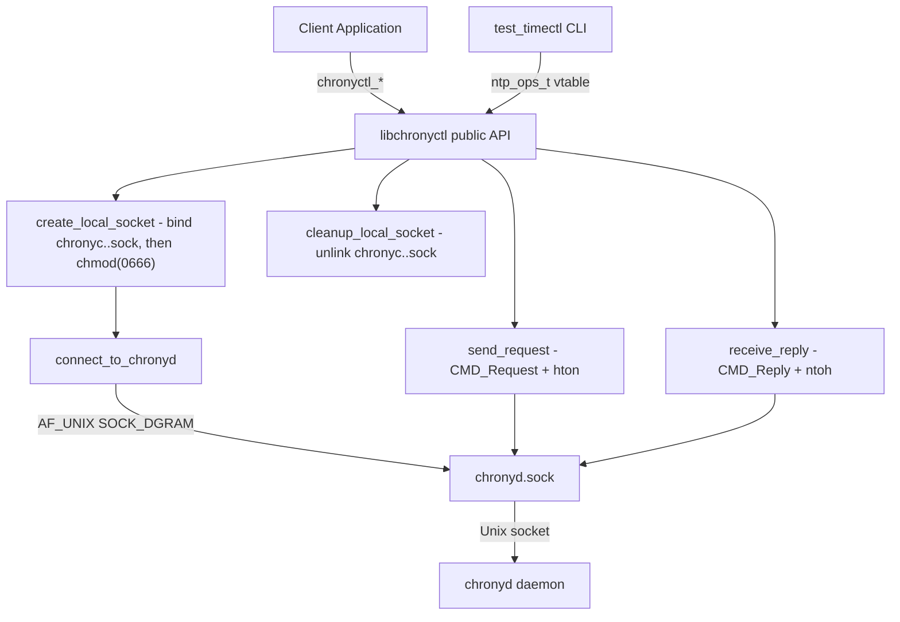
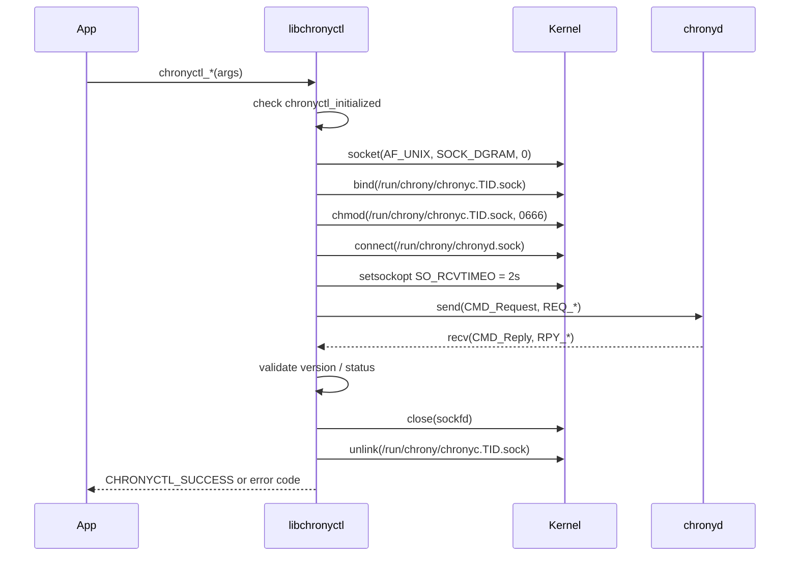

# libchronyctl — Architecture

## Overview

`libchronyctl` is a lightweight, embedded C library that provides programmatic control of the `chronyd` NTP daemon on RDK-based devices. It communicates directly over chronyd's native Unix domain socket protocol, replacing fragile `chronyc` CLI subprocess invocations with a typed, in-process API. While designed primarily for `chronyd`, the repository also ships a backend-agnostic test binary (`test_timectl`) whose `ntp_ops_t` function-pointer table can accommodate other NTP clients with no changes to the test harness.

---

## Design

The library is a thin synchronous shim between the calling application and the `chronyd` daemon. Every public API call follows the same three-step pattern: create a per-thread local Unix socket named `chronyc.<tid>.sock` and `chmod` it to `0666` after `bind()`, exchange exactly one request/reply packet with chronyd, then close and unlink that socket before returning. There are no background threads, no connection pool, and no persistent heap allocations.

### Component Diagram



### Dependency Map

```
libchronyctl.c
  ├── libchronyctl.h      (public API, error codes)
  ├── candm.h             (chronyd wire protocol: CMD_Request, CMD_Reply, REQ_*, RPY_*, STT_*)
  └── addressing.h        (IPAddr type, IPADDR_INET4/INET6/UNSPEC constants)

test_timectl.c
  ├── libchronyctl.h      (chrony backend)
  └── addressing.h        (IPAddr for burst/online wrappers)
```

---

## Key Components

### `libchronyctl.h` — Public API and Error Codes

Defines the `chronyctl_error` enum and all `chronyctl_*` function declarations.

```c
typedef enum {
    CHRONYCTL_SUCCESS       =  0,
    CHRONYCTL_ERROR_INIT    = -1,   /* init failed (reserved) */
    CHRONYCTL_ERROR_NOT_INIT= -2,   /* chronyctl_init() not yet called */
    CHRONYCTL_ERROR_EXEC    = -3,   /* protocol exchange failed */
    CHRONYCTL_ERROR_PARSE   = -4,   /* reply parse error (reserved) */
    CHRONYCTL_ERROR_INVALID = -5,   /* invalid argument (e.g. NULL pointer) */
    CHRONYCTL_ERROR_MUTEX   = -6,   /* mutex error (reserved) */
    CHRONYCTL_ERROR_NO_DATA = -7,   /* chronyd socket unreachable */
    CHRONYCTL_ERROR_UNAUTH  = -8    /* chronyd rejected: STT_UNAUTH */
} chronyctl_error;
```

### `candm.h` — Wire Protocol Types

Clean-room Apache-2.0 implementation of the chronyd control protocol definitions. Defines `CMD_Request`, `CMD_Reply`, all `REQ_*` command codes, `RPY_*` reply codes, `STT_*` status codes, and protocol data structures (`RPY_Tracking`, `REQ_NTP_Source`, `REQ_Del_Source`, `REQ_Burst`, etc.).

### `addressing.h` — Network Address Type

Defines `IPAddr` — a union holding an IPv4 address, IPv6 address, or numeric ID — and the `IPADDR_*` family constants. All addresses in `libchronyctl` are stored in **host byte order** in `IPAddr`; conversion to network byte order happens inside `ip_host_to_network()` before embedding in wire payloads.

### `libchronyctl.c` — Implementation

Contains all internal helpers and the public API implementations.

| Symbol | Type | Purpose |
|--------|------|---------|
| `chronyctl_initialized` | `static int` | Guard: set by `chronyctl_init()`, checked by every API |
| `chrony_sequence` | `static _Atomic uint32_t` | Per-request sequence counter; `_Atomic` makes the fetch-and-increment race-free across threads |
| `socket_paths[]` | `static const char*[]` | Probe list: `/run/chrony/chronyd.sock`, `/var/run/chrony/chronyd.sock` |
| `connect_to_chronyd()` | internal | Bind local socket, probe paths, set 2s recv timeout |
| `send_request()` | internal | Zero-fill `CMD_Request`, set version/type/command/sequence, `send()` |
| `receive_reply()` | internal | `recv()`, validate version/type/status, copy reply data |
| `cleanup_local_socket()` | internal | `unlink` both candidate local socket paths |
| `parse_address()` | internal | `getaddrinfo()` → `IPAddr` (IPv4 only) |
| `ip_host_to_network()` | internal | Convert an IPv4 IPAddr from host byte order to network byte order for chronyd requests |
| `float_to_double()` | internal | Decode chrony's 7-bit-exponent `Float` type to IEEE `double` |
| `find_source_ip_by_name()` | internal | Walk `REQ_N_SOURCES` / `REQ_SOURCE_DATA` / `REQ_NTP_SOURCE_NAME` to resolve hostname → tracked IP (DNS-rotation-safe) |

### `test_timectl.c` — Backend-Agnostic CLI

Provides a command-line interface for all library operations and demonstrates the `ntp_ops_t` abstraction for swapping NTP client backends at compile time.

```c
typedef struct {
    const char *name;
    int  (*init)(void);
    int  (*cleanup)(void);
    int  (*get_offset)(double *offset_sec);
    int  (*makestep)(void);
    int  (*add_server)(const char *host, int minpoll, int maxpoll);
    int  (*delete_server)(const char *host);
    int  (*set_poll)(const char *host, int minpoll, int maxpoll);
    int  (*burst)(const char *addr, const char *mask, int n_good, int n_total);
    int  (*online)(const char *addr, const char *mask);
    int  (*has_selectable_source)(int *has_selectable);
    const char *(*strerror)(int err);
} ntp_ops_t;
```

Adding a new backend requires only: adding a `#include`, filling in one `ntp_ops_t` row, and recompiling.

---

## Socket Lifecycle

Every `chronyctl_*` API call (except `init` and `cleanup`) executes this exact lifecycle. No socket state persists between calls.



**Key properties:**
- Socket is `AF_UNIX SOCK_DGRAM` — connectionless; one `send()` + one `recv()` per API call
- Local socket path uses the **thread ID** (TID via `gettid()`), not the PID, so concurrent threads do not race on bind/unlink; tried in order: `/run/chrony/`, `/var/run/chrony/`, `/var/run/`
- Socket permissions are set to `0666` via `chmod()` after `bind()` so chronyd can write back reply datagrams
- Receive timeout is 2 seconds; exceeding it returns `CHRONYCTL_ERROR_EXEC`
- Local socket is always unlinked, even on error paths

---

## Performance Considerations

| Metric | Value | Notes |
|--------|-------|-------|
| Per-call stack usage | ~1 KB peak | Largest: `chronyctl_add_server` with 520-byte payload |
| Persistent heap | 0 bytes | Stack-only model |
| Static footprint | 8 bytes | `initialized` flag + `sequence` counter |
| Socket connect latency | <1 ms on-device | Unix domain socket; loopback |
| Receive timeout | 2 seconds | Hard-coded in `connect_to_chronyd()` |
| CPU when idle | 0 | No background threads or timers |
| `find_source_ip_by_name` overhead | O(n) source queries | Delete/set_poll only; n = number of sources tracked by chronyd |

---

## Platform Notes

### Linux (general)

- chronyd socket probed in order: `/run/chrony/chronyd.sock`, `/var/run/chrony/chronyd.sock`
- Local reply socket: `/run/chrony/chronyc.<tid>.sock` (falls back to `/var/run/chrony/chronyc.<tid>.sock`, then `/var/run/chronyc.<tid>.sock`); no `/tmp` fallback is attempted
- Local socket permissions set to `0666` via `chmod()` after `bind()` (required on Raspberry Pi OS for the kernel `inode_permission` check)
- Receive timeout: 2 seconds (`SO_RCVTIMEO`)

### Constraints

| Constraint | Value |
|-----------|-------|
| chronyd protocol version | chrony 3.x+ (`PROTO_VERSION_NUMBER` from `candm.h`) |
| IP family | IPv4 only (`AF_INET`; `parse_address()` uses `hints.ai_family = AF_INET`) |
| Min stack per call | ~1 KB |
| Min RAM | No library-imposed minimum beyond kernel defaults |
| Build dependencies | C99 compiler, `libm` (`-lm` for `pow()`), POSIX sockets |

---

## See Also

- [libchronyctl.h](../libchronyctl.h) — Public API header and error code definitions
- [libchronyctl.c](../libchronyctl.c) — Full implementation with inline documentation
- [test_timectl.c](../test_timectl.c) — Backend-agnostic CLI and `ntp_ops_t` usage examples
- [api.md](api.md) — API reference, usage examples, error handling, and testing
- [README.md](../README.md) — Component quick-start
- [CONTRIBUTING.md](../../CONTRIBUTING.md) — Contribution guidelines
- [CHANGELOG.md](../../CHANGELOG.md) — Version history
