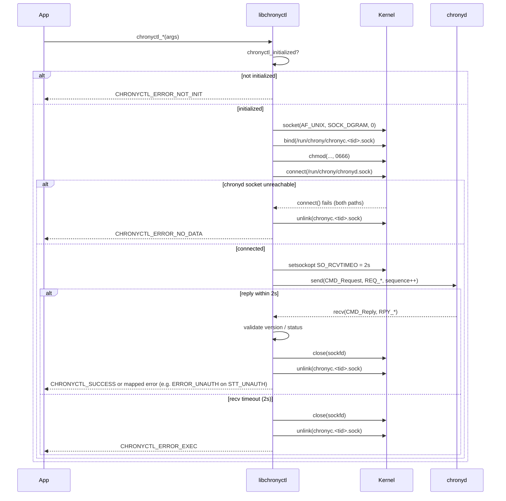
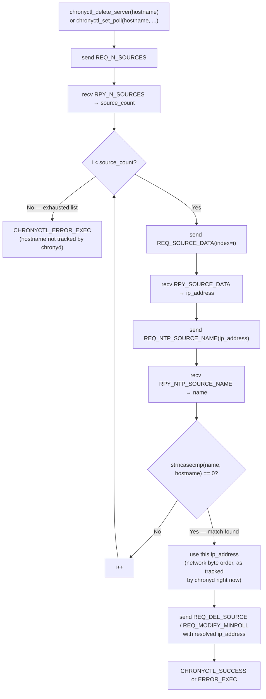

# Diagram: libchronyctl Request/Reply Socket Lifecycle

Shows the exact sequence every `chronyctl_*` data-plane call follows (socket creation through cleanup), plus the decision flow for the two DNS-rotation-safe operations (`delete_server`, `set_poll`) that resolve their target through chronyd's live source list instead of fresh DNS.

**Related spec:** [specs/libchronyctl/spec.md](../specs/libchronyctl/spec.md)

---

## Per-Call Lifecycle

> **Concurrency note**: the local socket name embeds the calling thread's TID (`gettid()`), not the process PID, so two threads calling `chronyctl_*` at the same time bind/unlink distinct paths and never race.

---

## DNS-Rotation-Safe Source Resolution (`delete_server`, `set_poll`)

**Why this matters:** if `getaddrinfo()` were called fresh at delete/set-poll time, a DNS record that rotated after the server was added could resolve to a different IP than the one chronyd actually tracks, causing `REQ_DEL_SOURCE` / `REQ_MODIFY_MINPOLL` to fail with `STT_NOSUCHSOURCE`. Walking chronyd's live source list first guarantees the IP used on the wire matches what chronyd currently has on record.
