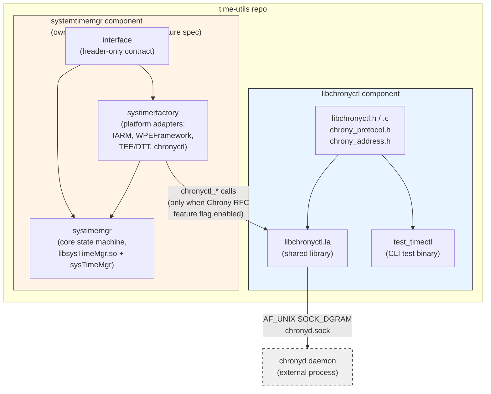

# Diagram: time-utils Repo Component Overview

Shows the components hosted in this repo, what each one produces, and how they relate to each other and to the external `chronyd` daemon. `systemtimemgr` owns a complete, independent OpenSpec instance under its own directory — this diagram shows only the repo-level boundary between components.

**Related spec:** [specs/architecture/spec.md](../specs/architecture/spec.md)

---

**Key properties:**
- `libchronyctl` has zero dependency on `systemtimemgr` — it builds, links, and is testable (`test_timectl`) entirely standalone against a bare `chronyd`.
- `systemtimemgr` links against `libchronyctl` only in the `systimerfactory` platform-adapter package; the core `systimemgr` package never includes `libchronyctl.h` directly (see [systemtimemgr/openspec/specs/architecture/spec.md](../../systemtimemgr/openspec/specs/architecture/spec.md)).
- The `chronyctl_*` calls themselves are further gated at runtime by the Chrony RFC feature flag — see [systemtimemgr/openspec/specs/chrony-ntp-sync/spec.md](../../systemtimemgr/openspec/specs/chrony-ntp-sync/spec.md) for that contract.
- For the internal thread/state-machine flow inside `systemtimemgr`, see its own diagram: [systemtimemgr/openspec/diagrams/03-systimemgr-architecture.md](../../systemtimemgr/openspec/diagrams/03-systimemgr-architecture.md).
